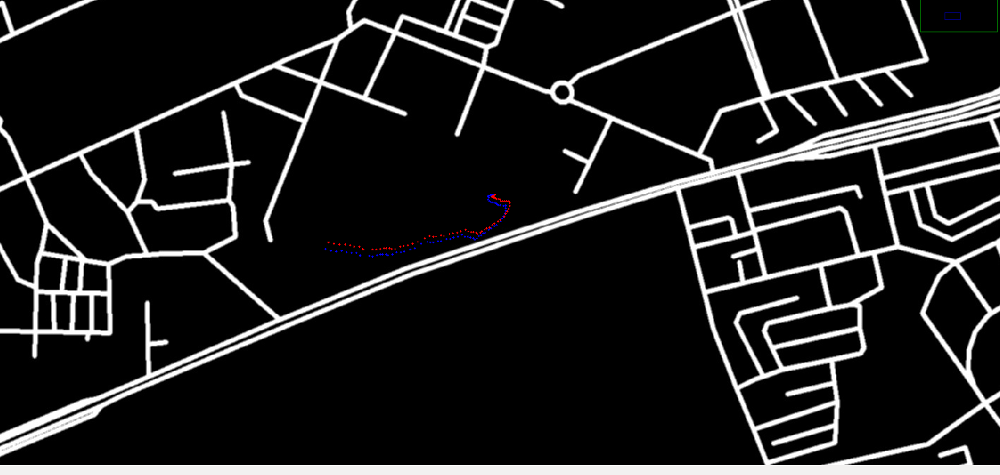

This package helps to visualise the odometry published by gps and vo on a open street map. 

Make sure that you opencv and opengl before using this. Also install this:

	sudo apt-get install ros-<rosdistro>-geodesy

To use the package, clone it in your catkin workspace and do a catkin_make or catkin build and then source it. 

Then do a: 	

		roslaunch odom_visualizer map_visualise.launch

This will open up a window like this:

You might need to zoom in a little bit to see the markers. The red markers show the odometry of gps while the blue markers show the odometry of zed. I will push the changes soon to fuse the imu_odom as well. 
